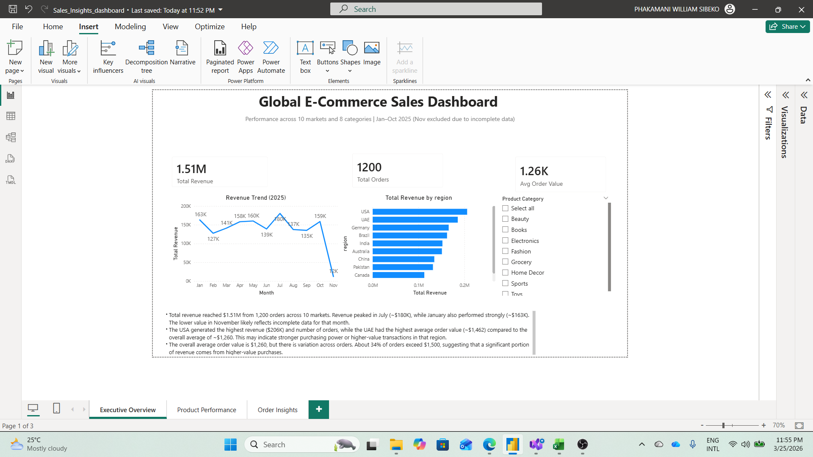
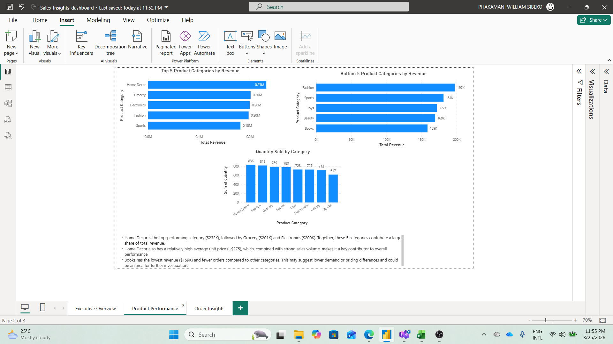
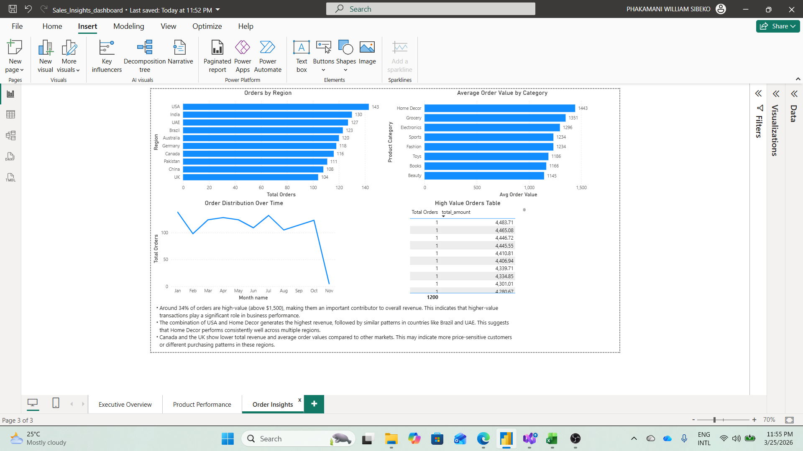

# Sales Insights Dashboard — Python + Power BI


A data analysis project exploring global e-commerce sales across 10 markets and 8 product categories. Built using Python for data preparation and Power BI for interactive reporting.

---

## Overview


This project transforms 1,200 raw transactional records into a 3-page interactive dashboard covering revenue trends, product performance, and order-level insights.

The dashboard is designed to support data-driven decision-making by highlighting key revenue drivers, underperforming categories, and regional trends.

The analysis is scoped to order-level data, as no customer identifiers exist in the source dataset.

---

## Tools & Technologies

| Layer | Tool |
|---|---|
| Data cleaning & transformation | Python 3 (Pandas) |
| Visualisation & reporting | Power BI Desktop |
| Dataset source | Kaggle — Global E-Commerce Sales 2025 |

---

## Dataset

- **Records:** 1,200 orders
- **Period:** January – October 2025 (November excluded — partial month)
- **Geography:** 10 countries (USA, UAE, Germany, Brazil, India, Australia, China, Pakistan, Canada, UK)
- **Categories:** Electronics, Fashion, Home Decor, Grocery, Sports, Toys, Beauty, Books
- **Limitation:** Dataset is transactional only (no customer IDs), so analysis focuses on order-level behaviour rather than customer retention or lifetime value

---

## Data Preparation (Python)

Script: `data_preprocessing.py`

Steps applied:

1. Standardised column names (lowercase, stripped whitespace)
2. Parsed and validated `order_date`. Dropped rows with missing dates, order IDs, or revenue
3. Removed duplicate records
4. Enforced numeric types on `total_amount`, `quantity`, and `unit_price`
5. Engineered new columns:
   - `month` (integer 1–12) — used as sort key in Power BI
   - `month_name` (Jan, Feb…) — display label on trend axis
   - `avg_order_value` — unit-level price per item (`total_amount / quantity`)
   - `order_tier` — order size segments: Small (<$250), Medium ($250–750), Large ($750–1500), XL (>$1500)
6. Renamed `country` → `region` and `category` → `product_category` for Power BI naming consistency
7. Exported cleaned file to `data/cleaned_ecommerce_data.csv`

---

## DAX Measures

```dax
Total Revenue = SUM(cleaned_ecommerce_data[total_amount])

Total Orders = COUNTROWS(cleaned_ecommerce_data)

Avg Order Value = DIVIDE([Total Revenue], [Total Orders])

High Value Orders =
CALCULATE(
    [Total Orders],
    cleaned_ecommerce_data[total_amount] > 1500
)

High Value Revenue =
CALCULATE(
    [Total Revenue],
    cleaned_ecommerce_data[total_amount] > 1500
)

Revenue % of Total =
DIVIDE(
    [Total Revenue],
    CALCULATE([Total Revenue], ALL(cleaned_ecommerce_data))
)
```

---

## Dashboard Pages

### Page 1 — Executive Overview



- Total revenue: **$1.51M** across 1,200 orders (Jan–Oct 2025)
- Revenue peaked in **July at $180K**; February was the weakest full month at $127K
- **USA leads on volume** ($206K, 143 orders), but **UAE leads on order quality** ($1,462 avg order value vs. the $1,260 overall average)
- Canada and UK trail all markets with the lowest average order values ($971 and $1,064)

### Page 2 — Product Performance



- **Home Decor** is the top category at $232K (15.4% of total revenue)
- Top 3 categories — Home Decor, Grocery, Electronics — account for **42% of total revenue**
- **Books** is the weakest category: fewest orders (136) and lowest revenue ($159K)
- Home Decor also commands the highest avg unit price at $275, combining volume and price strength

### Page 3 — Order Insights



- **34% of orders (413/1,200) are in the XL tier** (above $1,500) — the single largest segment by count
- **USA × Home Decor** is the top country-category combination at $39K
- Home Decor performs consistently across multiple geographies — top pairing in USA, Brazil, UAE, and Australia
- Canada and UK show the lowest average order values, which may indicate more price-sensitive purchasing behaviour

---

## Key Findings

| Finding | Detail |
|---|---|
| High-value order concentration | 34% of orders (XL tier >$1,500) contribute a significant share of 60% total revenue |
| UAE premium market signal | Highest avg order value ($1,462) despite ranking 2nd on total revenue |
| Home Decor dominance | #1 category by revenue, unit price, and geographic spread |
| July peak | Strongest single month at $180K — 33% above the Feb trough |
| Canada & UK underperformance | Lowest avg order values across all 10 markets |

---

## Limitations

- No customer identifiers — retention, churn, and lifetime value analysis are not possible
- November 2025 is a partial month and excluded from trend analysis
- No cost or margin data — revenue figures do not reflect profitability
- Geographic labels represent order destinations, not necessarily customer locations

---

## How to Run

**1. Clone the repository**
```bash
git clone https://github.com/idungamanzi/sales-insights-dashboard.git
cd sales-insights-dashboard
```

**2. Install dependencies**
```bash
pip install pandas
```

**3. Run the data preparation script**
```bash
python data_preprocessing.py
```
This will generate `data/cleaned_ecommerce_data.csv`.

**4. Open the dashboard**
- Open `Sales_Insights_dashboard.pbix` in Power BI Desktop
- If prompted, update the data source path to point to your local `data/cleaned_ecommerce_data.csv`
- Click **Refresh** in the Home ribbon

---

## Project Structure

```
sales-insights-dashboard/
│
├── data/
│   ├── global_ecommerce_sales.csv        # raw dataset
│   └── cleaned_ecommerce_data.csv        # processed output
│
├── data_preprocessing.py             # Python cleaning script
│
├── images/
│   ├── executive_overview.png
│   ├── product_performance.png
│   └── order_insights.png
│
├── Sales_Insights_dashboard.pbix                   # Power BI report file
└── README.md
```

---

*Dataset sourced from Kaggle — Global E-Commerce Sales Dataset 2025.*
